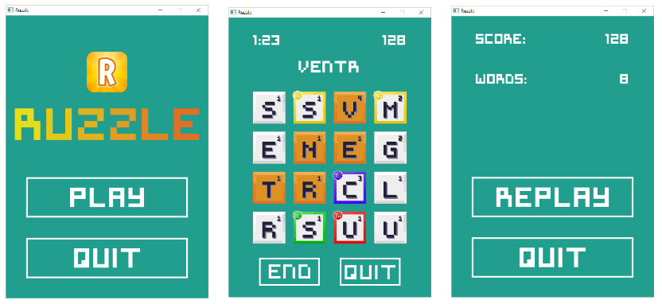

# Ruzzle

## Presentation

This is a **student project** made in 3 months with a team of 3 students. The instructions were to code a [Ruzzle game](http://ruzzle-game.com/) in **C** using the **SDL 2.0** librairy.

The goal is to score the highest within the **time limits** (2 minutes), by linking together the letters of the grid to create words.

In the **doc** folder, you will find a **diagram** with the various entities of the game, as well as our **report** containing more precise explanations, technical choices, organization, etc (in French).

## Screenshots

Some of the game's interfaces:

Every asset was made by us (except for the Ruzzle logo).

